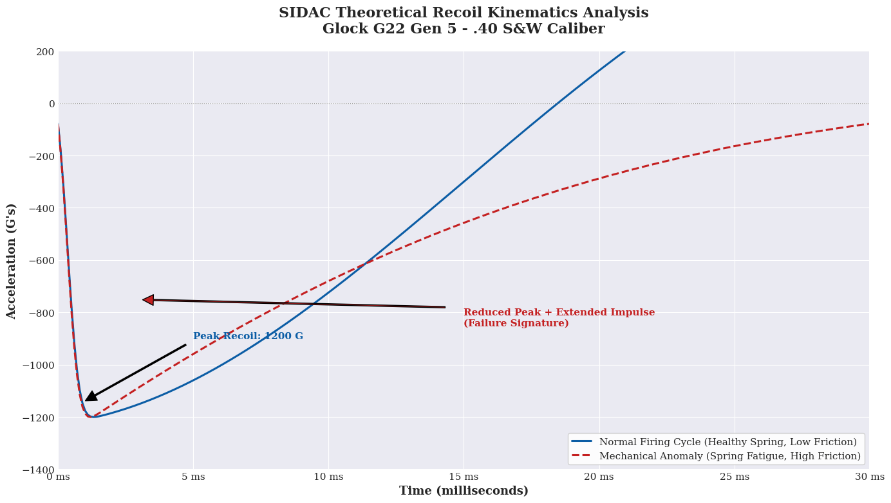
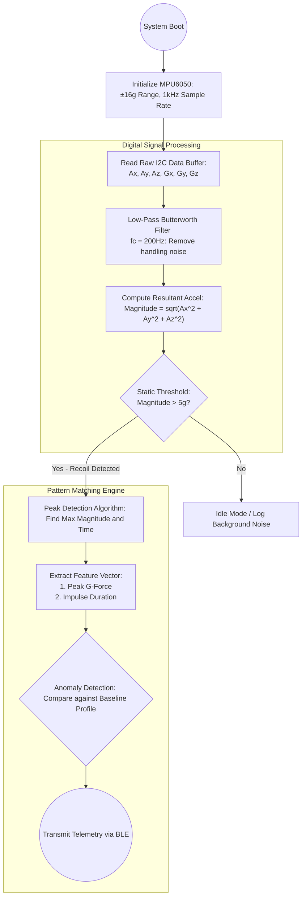

# Project SIDAC: Intelligent Diagnostic & Telemetry System for Handgun Failure Detection

**Conceptual Design Document & Proof of Concept**

**Author:** Filipe José Martins de Sá, Mechanical Engineer

**Status:** R&D Portfolio Concept

## 1. Problem Statement
Modern striker-fired handgun platforms, such as the Glock G22 Gen 5, are highly reliable but not immune to mechanical degradation. Subtle failures—including recoil spring fatigue, striker channel fouling, and sear surface wear—often manifest as minute changes in the firearm's kinematic signature before a catastrophic malfunction (e.g., failure to feed, failure to return to battery) occurs. Currently, there is no embedded, real-time diagnostic tool for operators or armorers to predict these failure modes purely from the weapon's dynamic response during the firing cycle.

## 2. The Solution: SIDAC
SIDAC is a conceptual Picatinny-rail-mounted telemetry unit that leverages a low-cost, high-fidelity Inertial Measurement Unit (IMU) and a microcontroller to perform edge-computing diagnostics. The system captures the complete high-G recoil impulse and slide velocity profile to algorithmically distinguish a "healthy" baseline from anomalous mechanical behavior. This transforms the handgun into an IoT-enabled diagnostic platform, providing predictive maintenance data without altering the firearm's internal mechanics.

## 3. System Architecture
- **Sensing Layer:** MPU6050 (6-axis IMU: 3-axis accelerometer ±16g, 3-axis gyroscope) for high-frequency motion capture.
- **Processing Layer:** ESP32 microcontroller for I2C data acquisition, digital signal processing, and Bluetooth Low Energy (BLE) telemetry broadcast.
- **Power:** 3.7V 300mAh LiPo battery with onboard charging management.
- **Enclosure:** Topology-optimized 3D-printed polymer housing, mechanically isolated from the Picatinny rail.

## 4. R&D Roadmap
1.  **Phase I: Theoretical Validation (Current)**
    - Development of a 1-DOF recoil kinematics mathematical model.
    - Python simulation of normal vs. anomalous recoil impulse signatures.
2.  **Phase II: Static Hardware-in-the-Loop**
    - Benchtop I2C validation and noise floor characterization of the ESP32/MPU6050 stack.
    - Implementation of Madgwick/Mahony sensor fusion for absolute orientation tracking.
3.  **Phase III: Dynamic Live-Fire Proof-of-Concept**
    - Shock survivability testing of the cantilevered PCB enclosure.
    - Dataset collection of live-fire cycles to train anomaly detection thresholds.
    - BLE telemetry streaming to a companion mobile application for real-time visualization.

  ## 5. Kinematic Signature Simulation

This graph demonstrates the theoretical mathematical model of the Glock G22 Gen 5 recoil kinematics, contrasting a healthy firing cycle with a mechanical anomaly (such as recoil spring fatigue).

## 6. Diagnostic Algorithm Logic

This flowchart illustrates the edge-computing logic processed by the ESP32 to filter handling noise, capture the recoil impulse, and execute pattern matching for anomaly detection.

##  Hardware Schematic & Pinout

This section defines the core electrical interconnects for the SIDAC prototype. The MPU6050 communicates via the I2C protocol.

### I2C Communication Interface (ESP32 ↔ MPU6050)

| ESP32 DevKit Pin | MPU6050 Pin | Wire Function | Electrical Notes |
| :--- | :--- | :--- | :--- |
| `GPIO 22` | `SCL` | I2C Clock | Serial Clock line. A 4.7kΩ pull-up resistor to 3.3V is typically required but often integrated onboard the MPU6050 breakout. |
| `GPIO 21` | `SDA` | I2C Data | Serial Data line. Requires 4.7kΩ pull-up to 3.3V. |
| `3V3` | `VCC` | Power Rail | Clean 3.3V supply from the ESP32's onboard regulator. Decouple with a 100nF ceramic capacitor at the MPU6050 pin. |
| `GND` | `GND` | Common Ground | Single-point star ground connection to minimize ground loop noise. |

### Power Management & Battery Connections

| ESP32 DevKit Pin | Component | Wire Function | Electrical Specifications |
| :--- | :--- | :--- | :--- |
| `5V` / `VIN` | LiPo Battery Management Board (e.g., TP4056) `OUT+` | Unregulated Input Power | 3.7V nominal LiPo input. The ESP32's AMS1117 regulator steps this down to 3.3V for the board. Operating range: 3.0V - 4.2V. |
| `GND` | LiPo Battery Management Board `OUT-` | Battery Ground | Direct connection. |
| LiPo Mgmt Board `B+` | LiPo Cell (3.7V 300mAh) `Positive Terminal` | Cell Positive | Protected 103450 cell with high discharge rate (1C min) recommended for voltage sag stability. |
| LiPo Mgmt Board `B-` | LiPo Cell (3.7V 300mAh) `Negative Terminal` | Cell Negative | Direct connection to cell. |

**The SIDAC project is part of a broader diagnostic ecosystem. For benchtop metrology and component-level validation, refer to the SIDAC-M1 Metrology Station documentation.**
