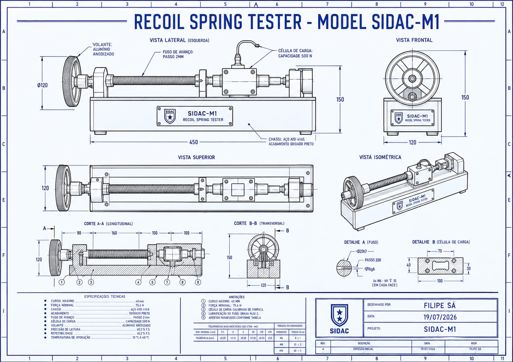

# SIDAC-M1: Recoil Spring Metrology Station

**Module:** Benchtop Diagnostic Tool for Glock G22 Gen 5
**Status:** R&D Concept Phase

## 1. Objective
A precision benchtop rig designed to quantify mechanical degradation in recoil springs, replacing subjective visual inspections with objective N/mm force-displacement data.

## 2. Technical Specifications
- **Reference Model:** Glock G22 Gen 5
- **Nominal Force:** 75.6N (17 lbf) at 40mm displacement.
- **Spring Constant (k):** 1.890 N/m.
- **Chassis:** AISI 4140 Steel, Black Oxide Finish.

## 3. Engineering Blueprint

## 4. Metrology Logic
The system utilizes a 500N Load Cell (HX711) and a lead-screw mechanism (2mm pitch) to perform automated force-displacement curves.
